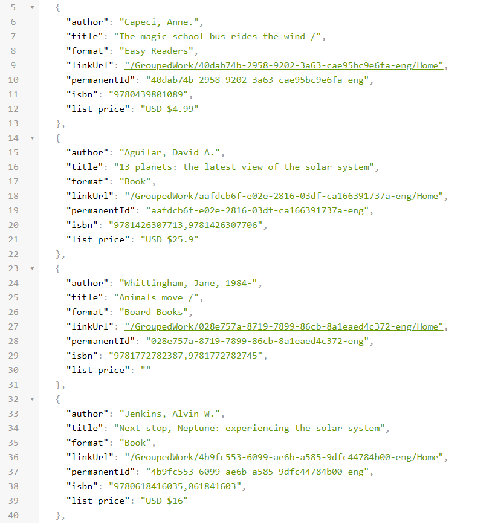
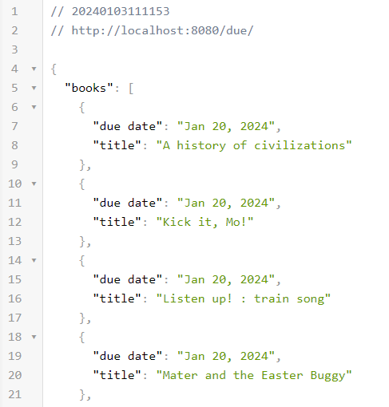
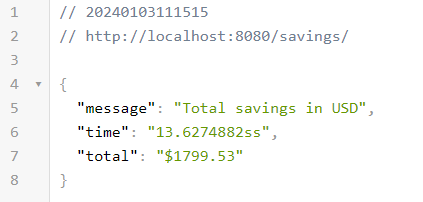

# LibraryAssistant

## Description
This is a library assistant that helps you to get the checked out books in the library account (Round Rock Public Library) and calculate the total savings you have made by borrowing books from the library instead of buying them.
The application also offers an API to get the list price of a book per its ISBN.

## Installation and Usage
1. Clone the repository
2. Install the requirements
3. Run the application with `go run main.go`
4. Open the browser and go to http://localhost:8080

## API Endpoints
1. Welcome page: http://localhost:8080
2. Check list price of a book by its ISBN: http://localhost:8080/ISBN/9781603090575
3. Get the list of all books checked out by a user: http://localhost:8080/history/
4. Get the list of books that are currently checked out by a user: http://localhost:8080/due/
5. Check the total savings of a user: http://localhost:8080/savings/

## Screenshots
### Reading history

### Currently checked out books

### Savings

